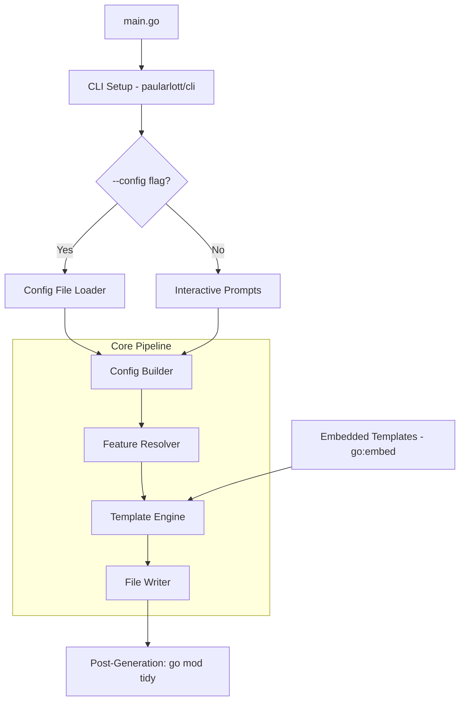

# Design Document: Go Scaffolder

## Overview

The Go Scaffolder is a CLI tool, itself written in Go, that generates fully functional Go microservice projects following Fortix architecture conventions. The user provides an application name, output directory, and a feature set. The scaffolder renders Go `text/template` templates into a complete project skeleton, then runs `go mod tidy` to resolve dependencies.

The scaffolder supports two input modes:
1. **Interactive mode** (default): prompts the user for all configuration via terminal prompts.
2. **Config file mode** (`--config <path>`): reads all configuration from a YAML file, enabling fully automated/scripted scaffolding with no interactive prompts.

The scaffolder is a single-binary CLI using `github.com/paularlott/cli` for its own CLI framework (consistent with Fortix conventions). All templates are embedded via `go:embed` so it ships as a single executable.

### Key Design Decisions

1. **Templates embedded via `go:embed`**: All template files are embedded in the scaffolder binary — no external file dependencies.
2. **Two-pass generation**: First, compute the full set of files to generate based on feature selection. Second, render all templates to in-memory buffers. Only write to disk if all templates render successfully (atomic generation — no partial output on error).
3. **No hardcoded versions in `go.mod` templates**: The generated `go.mod` lists `require` directives without version strings. `go mod tidy` resolves them to latest.
4. **Feature dependency auto-resolution**: Nomad automatically includes Docker. CLI is always included regardless of user selection.
5. **`text/template` with a shared FuncMap**: A single template function map provides helpers like `toLower`, `toCamel`, `toSnake`, and feature-check predicates.
6. **SRV resolution as a shared internal package**: When DB, Cache, or API features are selected, the scaffolded app includes an `internal/resolve/` package that checks configured hosts for DNS SRV records and resolves them to real address:port pairs at runtime.
7. **YAML for config file mode**: The `--config` flag accepts a YAML file. YAML was chosen over TOML/JSON for readability and because it handles nested feature selections cleanly.

## Architecture



### Pipeline Flow

1. **CLI Setup**: Parse flags including `--config <path>`. Set up the root command via `paularlott/cli`.
2. **Input Collection**: Either load and parse the YAML config file, or collect App_Name, Output_Directory, and Feature_Set interactively via terminal prompts.
3. **Config Builder**: Assemble a `ProjectConfig` struct from the collected inputs. Validate all values using the same rules regardless of input mode.
4. **Feature Resolver**: Apply dependency rules (Nomad → Docker, CLI always on). Validate mutual exclusivity (Redis vs Valkey). Determine if `internal/resolve/` is needed (any of DB, Cache, or API enabled).
5. **Template Engine**: Load embedded templates, filter by enabled features, render each template with `ProjectConfig` as data.
6. **File Writer**: Write rendered files to the output directory. Create directories as needed.
7. **Post-Generation**: Run `go mod tidy` in the output directory. Report success or failure.

## Components and Interfaces

### Package: `main`

Entry point. Wires the CLI root command with `--config` flag and invokes the scaffolding pipeline.

```go
package main

import "github.com/paularlott/cli"

func main() {
    app := cli.New("go-scaffolder", "Scaffold a Fortix Go microservice")
    app.Flags = []cli.Flag{
        {Name: "config", Help: "Path to YAML config file for non-interactive mode"},
    }
    app.Action = runScaffold
    app.Run()
}
```

### Package: `internal/prompt`

Handles interactive user input collection.

```go
type Prompter interface {
    AskString(label string, validate func(string) error) (string, error)
    AskMultiSelect(label string, options []string) ([]string, error)
    AskSelect(label string, options []string) (string, error)
    Confirm(label string) (bool, error)
}
```

### Package: `internal/configfile`

Handles loading and parsing the YAML config file for non-interactive mode.

```go
// ScaffoldConfig represents the YAML config file structure.
type ScaffoldConfig struct {
    AppName   string   `yaml:"app_name"`
    OutputDir string   `yaml:"output_dir"`
    Features  []string `yaml:"features"`  // e.g. ["api", "db", "cache", "docker"]
    DBType    string   `yaml:"db_type"`   // "mysql", "postgresql", "sqlite"
    CacheType string   `yaml:"cache_type"` // "redis", "valkey"
}

// Load reads and parses a YAML config file, returning a ScaffoldConfig.
func Load(path string) (*ScaffoldConfig, error)

// ToProjectConfig converts a ScaffoldConfig to a ProjectConfig,
// applying the same validation rules as interactive mode.
func (sc *ScaffoldConfig) ToProjectConfig() (*config.ProjectConfig, error)
```

### Package: `internal/config`

Defines the project configuration model and feature resolution logic.

```go
type ProjectConfig struct {
    AppName    string
    OutputDir  string
    ModulePath string
    Features   FeatureSet
    DBType     DBType
    CacheType  CacheType
}

type FeatureSet struct {
    CLI    bool // always true
    API    bool
    MCP    bool
    UI     bool
    DB     bool
    Cache  bool
    Docker bool
    Nomad  bool
}

type DBType string
const (
    DBMySQL      DBType = "mysql"
    DBPostgreSQL DBType = "postgresql"
    DBSQLite     DBType = "sqlite"
)

type CacheType string
const (
    CacheRedis  CacheType = "redis"
    CacheValkey CacheType = "valkey"
)

// NeedsSRVResolve returns true if any feature requiring network
// connections is enabled (DB, Cache, or API).
func (fs *FeatureSet) NeedsSRVResolve() bool {
    return fs.DB || fs.Cache || fs.API
}

// ResolveFeatures applies dependency rules:
// - CLI is always enabled
// - Nomad implies Docker
func ResolveFeatures(fs *FeatureSet) {
    fs.CLI = true
    if fs.Nomad {
        fs.Docker = true
    }
}

// Validate checks mutual exclusivity and required sub-selections.
func (pc *ProjectConfig) Validate() error { ... }
```

### Package: `internal/engine`

Template rendering engine. Loads embedded templates, filters by feature, renders to buffers.

```go
type Engine struct {
    templates embed.FS
    funcMap   template.FuncMap
}

// RenderAll renders all applicable templates for the given config.
// Returns a map of relative file paths to rendered content.
// Returns an error if any template fails to render (no partial output).
func (e *Engine) RenderAll(cfg *config.ProjectConfig) (map[string][]byte, error)

// TemplateManifest returns the list of template files and their
// feature guards.
func (e *Engine) TemplateManifest() []TemplateEntry

type TemplateEntry struct {
    TemplatePath     string   // path within embedded FS
    OutputPath       string   // relative output path (may contain {{.AppName}})
    RequiredFeatures []string // features that must be enabled
}
```

### Package: `internal/writer`

Writes rendered files to disk.

```go
// WriteAll writes all rendered files to the output directory.
// Creates directories as needed. Returns error on any I/O failure.
func WriteAll(outputDir string, files map[string][]byte) error
```

### Package: `internal/postgen`

Runs post-generation steps.

```go
// RunGoModTidy executes `go mod tidy` in the given directory.
// Returns the combined stdout/stderr output and any error.
func RunGoModTidy(dir string) (string, error)
```

### SRV Resolution Package (in Scaffolded App)

When any of DB, Cache, or API features are enabled, the scaffolder generates an `internal/resolve/` package in the scaffolded app. This package provides DNS SRV record resolution at runtime.

```go
// Generated in scaffolded app: internal/resolve/resolve.go
package resolve

import "net"

// SRVResult holds the resolved address and port from a DNS SRV lookup.
type SRVResult struct {
    Host string
    Port uint16
}

// LookupSRV attempts to resolve the given host as a DNS SRV record.
// If the host is a valid SRV record, it returns the resolved target and port.
// If the host is not an SRV record (lookup fails), it returns the original
// host unchanged with the provided default port.
func LookupSRV(host string, defaultPort uint16) (*SRVResult, error) {
    _, addrs, err := net.LookupSRV("", "", host)
    if err != nil || len(addrs) == 0 {
        return &SRVResult{Host: host, Port: defaultPort}, nil
    }
    return &SRVResult{
        Host: addrs[0].Target,
        Port: addrs[0].Port,
    }, nil
}
```

The generated DB, Cache, and API initialization code calls `resolve.LookupSRV()` on configured hosts before establishing connections. This is transparent — if the host is a regular hostname/IP, it passes through unchanged.

### Template Organization

Templates are stored in a `templates/` directory embedded via `go:embed`:

```
templates/
├── base/                    # Always included
│   ├── main.go.tmpl
│   ├── go.mod.tmpl
│   ├── build/
│   │   └── version.go.tmpl
│   ├── Taskfile.yml.tmpl
│   └── {{.AppName}}-config.toml.tmpl
├── cmd/                     # CLI feature (always included)
│   ├── serve.go.tmpl
│   ├── init.go.tmpl
│   └── completion.go.tmpl
├── api/                     # API feature
│   ├── cmd/api_routes.go.tmpl
│   ├── internal/rest/helpers.go.tmpl
│   ├── internal/auth/auth.go.tmpl
│   ├── internal/ctxkeys/ctxkeys.go.tmpl
│   ├── internal/sample/handler.go.tmpl
│   ├── internal/sample/service.go.tmpl
│   ├── internal/sample/storage.go.tmpl
│   └── openapi.yaml.tmpl
├── mcp/                     # MCP feature
│   └── cmd/mcp.go.tmpl
├── ui/                      # UI feature
│   ├── web/embed.go.tmpl
│   ├── web/src/...
│   ├── web/templates/base.html.tmpl
│   └── web/package.json.tmpl
├── db/                      # DB feature
│   ├── internal/db/db.go.tmpl
│   └── internal/db/schema.sql.tmpl
├── cache/                   # Cache feature
│   ├── redis/internal/redis/redis.go.tmpl
│   └── valkey/internal/valkey/valkey.go.tmpl
├── resolve/                 # SRV resolution (when DB, Cache, or API)
│   └── internal/resolve/resolve.go.tmpl
├── docker/                  # Docker feature
│   └── Dockerfile.tmpl
├── nomad/                   # Nomad feature
│   └── {{.AppName}}.nomad.tmpl
└── tests/                   # Test file templates (mirror source structure)
    ├── base/...
    ├── cmd/...
    ├── api/...
    ├── resolve/...
    └── ...
```

Each template directory maps to a feature. The `resolve/` templates use a special feature guard: they are included when `NeedsSRVResolve()` returns true (i.e., any of DB, Cache, or API is enabled).

## Data Models

### ProjectConfig

The central data structure passed to all templates during rendering.

| Field | Type | Description |
|-------|------|-------------|
| `AppName` | `string` | User-provided application name |
| `OutputDir` | `string` | Target directory for generated files |
| `ModulePath` | `string` | Go module path (derived from AppName) |
| `Features` | `FeatureSet` | Enabled feature flags |
| `DBType` | `DBType` | Selected database engine (when DB enabled) |
| `CacheType` | `CacheType` | Selected cache engine (when Cache enabled) |

### FeatureSet

| Field | Type | Default | Description |
|-------|------|---------|-------------|
| `CLI` | `bool` | `true` | Always enabled |
| `API` | `bool` | `false` | HTTP REST API |
| `MCP` | `bool` | `false` | Model Context Protocol |
| `UI` | `bool` | `false` | Web frontend |
| `DB` | `bool` | `false` | Database persistence |
| `Cache` | `bool` | `false` | Cache integration |
| `Docker` | `bool` | `false` | Dockerfile generation |
| `Nomad` | `bool` | `false` | Nomad job definition |

### ScaffoldConfig (YAML Config File)

The structure of the YAML config file for non-interactive mode.

```yaml
app_name: my-service
output_dir: ./output
features:
  - api
  - db
  - cache
  - docker
db_type: postgresql
cache_type: redis
```

| Field | Type | Required | Description |
|-------|------|----------|-------------|
| `app_name` | `string` | Yes | Application name |
| `output_dir` | `string` | Yes | Output directory path |
| `features` | `[]string` | Yes | List of feature names to enable |
| `db_type` | `string` | When DB selected | Database engine: mysql, postgresql, sqlite |
| `cache_type` | `string` | When Cache selected | Cache engine: redis, valkey |

### TemplateEntry

| Field | Type | Description |
|-------|------|-------------|
| `TemplatePath` | `string` | Path within the embedded template FS |
| `OutputPath` | `string` | Relative output path, supports `{{.AppName}}` substitution |
| `RequiredFeatures` | `[]string` | List of feature names that must all be enabled |

### Template FuncMap

| Function | Signature | Description |
|----------|-----------|-------------|
| `toLower` | `func(string) string` | Lowercase conversion |
| `toUpper` | `func(string) string` | Uppercase conversion |
| `toCamel` | `func(string) string` | camelCase conversion |
| `toPascal` | `func(string) string` | PascalCase conversion |
| `toSnake` | `func(string) string` | snake_case conversion |
| `toKebab` | `func(string) string` | kebab-case conversion |
| `hasFeature` | `func(string) bool` | Check if a feature is enabled |
| `needsSRV` | `func() bool` | Check if SRV resolution package is needed |

## Correctness Properties

*A property is a characteristic or behavior that should hold true across all valid executions of a system — essentially, a formal statement about what the system should do. Properties serve as the bridge between human-readable specifications and machine-verifiable correctness guarantees.*

### Property 1: Feature resolution invariants

*For any* `FeatureSet`, after calling `ResolveFeatures`, the `CLI` field must be `true`, and if `Nomad` is `true` then `Docker` must also be `true`.

**Validates: Requirements 1.6, 3.4, 9.3, 10.2**

### Property 2: App name validation rejects empty/whitespace input

*For any* string composed entirely of whitespace characters (including the empty string), the App_Name validation function must return an error and reject the input.

**Validates: Requirements 1.7**

### Property 3: Feature-conditional file inclusion

*For any* valid `ProjectConfig`, the set of files produced by `RenderAll` must contain exactly those files whose `RequiredFeatures` are all satisfied by the config's enabled features — no extra files for disabled features, no missing files for enabled features. This includes the `internal/resolve/` package being present if and only if `NeedsSRVResolve()` is true (any of DB, Cache, or API enabled).

**Validates: Requirements 12.3, 4.1, 4.4, 4.5, 4.6, 4.8, 5.2, 6.1, 6.2, 6.3, 6.4, 7.1, 7.2, 8.1, 8.4, 9.1, 10.1, 16.4, 2.1, 2.3, 3.1, 3.2, 3.3**

### Property 4: App_Name substitution in rendered output

*For any* valid `ProjectConfig` with a non-empty `AppName`, every rendered file that references the application name (module path in go.mod, config file name, openapi.yaml title, Nomad job name) must contain the exact `AppName` string.

**Validates: Requirements 12.2, 2.2, 4.7**

### Property 5: go.mod contains correct dependencies for enabled features

*For any* valid `ProjectConfig`, the rendered `go.mod` must contain `require` directives for exactly the dependencies implied by the enabled features: `paularlott/cli` and `paularlott/logger` always; `paularlott/mcp` when MCP is enabled; the correct DB driver (`lib/pq`, `go-sql-driver/mysql`, or `modernc.org/sqlite`) when DB is enabled with the corresponding DB_Type; and the correct cache client library when Cache is enabled.

**Validates: Requirements 2.6, 2.7, 5.1, 7.4, 7.5, 7.6, 8.2, 8.5**

### Property 6: go.mod contains no hardcoded version strings

*For any* valid `ProjectConfig`, the rendered `go.mod` template output must not contain version strings in `require` directives (versions are resolved by `go mod tidy` post-generation).

**Validates: Requirements 14.2**

### Property 7: Config TOML contains correct sections for enabled features

*For any* valid `ProjectConfig`, the rendered `<AppName>-config.toml` must contain the `[log]` section always, plus `[server]` when API is enabled, `[database]` when DB is enabled, `[redis]` when Cache=Redis, and `[valkey]` when Cache=Valkey — and must not contain sections for disabled features.

**Validates: Requirements 2.5, 4.9, 7.7, 8.3, 8.6**

### Property 8: Taskfile.yml contains correct tasks for enabled features

*For any* valid `ProjectConfig`, the rendered `Taskfile.yml` must contain `build`, `test`, and `lint` tasks with AMD64 and ARM64 targets, `CGO_ENABLED=0`, and `-ldflags` injecting `build.Version` and `build.Date`. When the UI feature is enabled, it must also contain a frontend build task.

**Validates: Requirements 2.4, 6.5, 13.1, 13.2, 13.3**

### Property 9: Test file parity with source files

*For any* valid `ProjectConfig`, for every `.go` source file in the rendered output (excluding `_test.go` files themselves and `main.go`), there must be a corresponding `_test.go` file, and each test file must contain at least one function whose name starts with `Test`.

**Validates: Requirements 15.1, 15.2**

### Property 10: Dockerfile correctness based on feature combination

*For any* valid `ProjectConfig` with Docker enabled, the rendered `Dockerfile` must implement a multi-stage build with `CGO_ENABLED=0`. When UI is also enabled, the Dockerfile must include an additional frontend build stage.

**Validates: Requirements 9.1, 9.2**

### Property 11: Configuration wiring in main.go

*For any* valid `ProjectConfig`, the rendered `main.go` must contain code that sets up configuration loading from TOML config files, dotenv files, and environment variables via `paularlott/cli`.

**Validates: Requirements 3.6, 3.7**

### Property 12: DB schema uses UUIDv7 primary keys

*For any* valid `ProjectConfig` with DB enabled, the rendered `schema.sql` must use UUIDv7-compatible column types for all primary key fields.

**Validates: Requirements 7.3**

### Property 13: MCP wiring in serve command

*For any* valid `ProjectConfig` with MCP enabled, the rendered `cmd/serve.go` must contain MCP server initialization and startup code.

**Validates: Requirements 5.3**

### Property 14: API health and metrics endpoints registered

*For any* valid `ProjectConfig` with API enabled, the rendered route registration files must contain handler registrations for `GET /health` and `GET /metrics`.

**Validates: Requirements 4.2, 4.3**

### Property 15: No partial output on template error

*For any* `ProjectConfig` that causes a template rendering error, the file writer must not write any files to the output directory.

**Validates: Requirements 12.4**

### Property 16: SRV resolution usage in feature initialization code

*For any* valid `ProjectConfig` where DB, Cache, or API is enabled, the generated initialization code for that feature must call `resolve.LookupSRV` on the configured host before establishing a connection.

**Validates: Requirements 16.1, 16.2, 16.3**

### Property 17: Config file mode produces identical output to interactive mode

*For any* set of scaffolding parameters, the output produced when those parameters are provided via a YAML config file (using `--config`) must be identical to the output produced when the same parameters are entered interactively. The same validation rules must apply in both modes.

**Validates: Requirements 17.2, 17.4**

### Property 18: Config file missing required fields produces error

*For any* YAML config file that is missing one or more required fields (app_name, output_dir), the scaffolder must return an error that lists the missing field names and must not produce any output files.

**Validates: Requirements 17.3**

## Error Handling

| Error Condition | Handling Strategy |
|----------------|-------------------|
| Empty App_Name | Validation rejects; re-prompt in interactive mode, error+exit in config file mode |
| Output directory already has files | Warn and ask for confirmation in interactive mode; in config file mode, proceed without prompting (CI use case) |
| Template rendering failure | Collect error with template name, abort before writing any files, display error to user |
| `go mod tidy` failure | Display the stderr/stdout from the command, inform user that dependency resolution failed, but leave generated files in place |
| Output directory creation failure | Display OS error, abort generation |
| Invalid feature combination | `Validate()` catches impossible states (e.g., Cache enabled without CacheType); display error and re-prompt or exit |
| Config file not found | Display file-not-found error with the provided path, exit with non-zero status |
| Config file parse error | Display YAML parse error with line number if available, exit with non-zero status |
| Config file missing required fields | Display error listing all missing field names, exit with non-zero status |
| Config file invalid values | Apply same validation as interactive mode; display specific validation errors, exit with non-zero status |
| SRV resolution failure at runtime (scaffolded app) | Fall back to using the configured host as-is with the default port; log a warning |

### Error Design Principles

1. **Atomic generation**: Template rendering happens entirely in memory. Files are only written to disk after all templates render successfully. This prevents partial/broken project output.
2. **Fail fast on validation**: Input validation happens before any template rendering or file I/O, regardless of input mode.
3. **Graceful degradation for post-gen**: If `go mod tidy` fails, the generated files are still on disk. The user can fix the issue and run `go mod tidy` manually.
4. **Config file mode is strict**: In non-interactive mode, any validation failure results in an immediate error and exit — there is no opportunity to re-prompt.
5. **SRV resolution is best-effort**: In the scaffolded app, SRV lookup failure is not fatal — the original host is used as a fallback.

## Testing Strategy

### Dual Testing Approach

The scaffolder uses both unit tests and property-based tests for comprehensive coverage.

### Property-Based Testing

**Library**: [rapid](https://github.com/flyingmutant/rapid) — a Go property-based testing library.

**Configuration**:
- Minimum 100 iterations per property test
- Each test tagged with a comment referencing the design property
- Tag format: `// Feature: go-scaffolder, Property {number}: {property_text}`
- Each correctness property is implemented by a single property-based test

**Generators**:
- `ProjectConfig` generator: produces random valid configs with random App_Names (alphanumeric, 3-30 chars), random feature combinations, and appropriate DB_Type/CacheType when those features are enabled
- `FeatureSet` generator: produces all valid combinations of feature flags
- `AppName` generator: produces valid and invalid (empty/whitespace) app names
- `ScaffoldConfig` generator: produces random YAML config structures, including variants with missing required fields for error testing

**Property tests cover**: Properties 1-18 as defined in the Correctness Properties section above.

### Unit Tests

Unit tests complement property tests by covering:

- **Specific examples**: Known feature combinations (e.g., API+DB+Docker) produce expected file sets
- **Edge cases**: Template rendering errors produce no output (Property 15), empty directories are created (Req 1.8)
- **Integration points**: `go mod tidy` execution, file writing to disk
- **Template content spot-checks**: Specific rendered content matches expected patterns
- **Config file loading**: Valid YAML parses correctly, invalid YAML produces clear errors
- **SRV resolution fallback**: When DNS lookup fails, original host is returned unchanged

### Integration Tests

Integration tests verify end-to-end correctness of the generated projects:

- Generate a project with each major feature combination (both interactive and config file mode)
- Run `go build ./...` on the generated project (Req 11.1)
- Run `go vet ./...` on the generated project (Req 11.2)
- Run `go test ./...` on the generated project (Req 15.3)
- Start the generated app with API feature and verify `GET /health` returns 200 (Req 11.3)
- Verify config file mode produces identical output to interactive mode for the same inputs

These are slower tests and should be tagged for separate CI execution.

### Test Organization

```
internal/
├── config/
│   └── config_test.go        # Property tests for feature resolution, validation
├── configfile/
│   └── configfile_test.go     # Property tests for config file loading, missing fields
├── engine/
│   └── engine_test.go         # Property tests for template rendering, file inclusion
├── writer/
│   └── writer_test.go         # Unit tests for file writing
├── postgen/
│   └── postgen_test.go        # Unit tests for go mod tidy execution
└── prompt/
    └── prompt_test.go         # Unit tests for input validation
tests/
└── integration_test.go        # Integration tests (go build, go vet, go test on generated projects)
```
